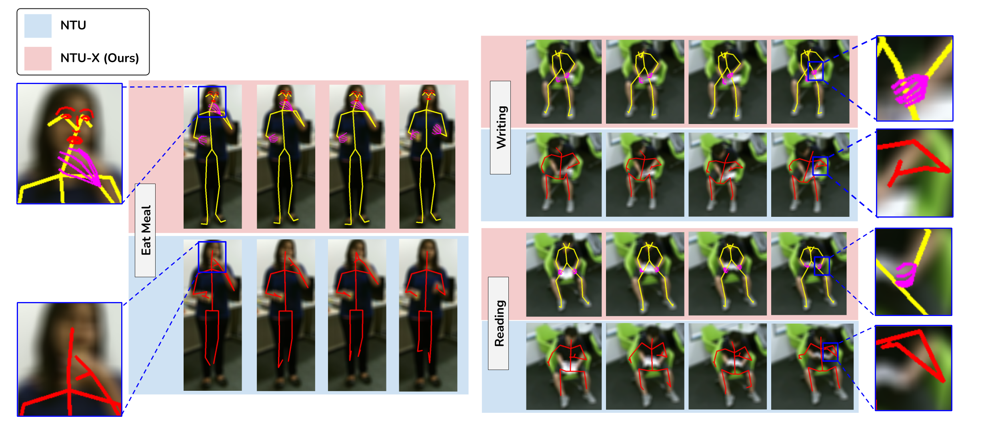

# NTU-X

This repository contains details and pretrained models for the newly introduced dataset NTU-X, which is an extended version of popular NTU dataset.

### What is NTU-X

The original NTU dataset contains the human action skeleton which are captured using the Kinect. These skeletons have <b>25 joints</b>. However, all the current top performing models seem to be bottlenecked at certain classes which involve finer finger level movements such as, reading, writing, eat meal etc.

Hence the new NTU-X dataset, introduces a more detailed <b>118 joints</b> skeleton for the action sequences of the NTU dataset. This new dataset, along with 25 body joints, contains <b>42 finger joints</b> and <b>51 face joints</b>.

### Comparing NTU-X to other popular action datasets.

<table>

<tr>
<th>Dataset</th>
<th>Body</th>
<th>Fingers</th>
<th>Face</th>
<th># Joints</th>
<th># Sequences</th>
<th># Classes</th>
</tr>

<tr>
<td align = "center">MSR-Action 3d</td>
<td align = "center">:heavy_check_mark:</td>
<td/>
<td/>
<td align = "center">20</td>
<td align = "center">567</td>
<td align = "center">20</td>
</tr>

<tr>
<td align = "center">Northwestern-UCLA</td>
<td align = "center">:heavy_check_mark:</td>
<td/>
<td/>
<td align = "center">24</td>
<td align = "center">1475</td>
<td align = "center">10</td>
</tr>

<tr>
<td align = "center">NTU-RGB+D</td>
<td align = "center">:heavy_check_mark:</td>
<td/>
<td/>
<td align = "center">25</td>
<td align = "center">56880</td>
<td align = "center">60</td>
</tr>

<tr>
<td align = "center"><b>NTU-X (Ours)</b></td>
<td align = "center">:heavy_check_mark:</td>
<td align = "center">:heavy_check_mark:</td>
<td align = "center">:heavy_check_mark:</td>
<td align = "center"><b>118</b></td>
<td align = "center"><b>56148</b></td>
<td align = "center"><b>60</b></td>
</tr>

</table>

### Download NTU-X dataset

<i>Coming Soon...</i>

### Pretained Models

Few experiments are performed to benchmark this new dataset using the top performing models of the original NTU RGB+D dataset. Details about this models can be found at [Models](./models/)

### The classes included in NTU-X

NTU-X contains same classes as NTU RGB+D dataset. The action labels are mentioned below:

<table>
<tr>
<td align = "center"><b>A1</b> drink water. </td>
<td align = "center"><b>A2</b> eat meal/snack. </td>
<td align = "center"><b>A3</b> brushing teeth. </td>
</tr>

<tr>
<td align = "center"><b>A4</b> brushing hair. </td>
<td align = "center"><b>A5</b> drop. </td>
<td align = "center"><b>A6</b> pickup. </td>
</tr>

<tr>
<td align = "center"><b>A7</b> throw. </td>
<td align = "center"><b>A8</b> sitting down. </td>
<td align = "center"><b>A9</b> standing up (from sitting position).</td>
</tr>

<tr>
<td align = "center"><b>A10</b> clapping. </td>
<td align = "center"><b>A11</b> reading. </td>
<td align = "center"><b>A12</b> writing. </td>
</tr>

<tr>
<td align = "center"><b>A13</b> tear up paper. </td>
<td align = "center"><b>A14</b> wear jacket. </td>
<td align = "center"><b>A15</b> take off jacket. </td>
</tr>

<tr>
<td align = "center"><b>A16</b> wear a shoe. </td>
<td align = "center"><b>A17</b> take off a shoe. </td>
<td align = "center"><b>A18</b> wear on glasses. </td>
</tr>

<tr>
<td align = "center"><b>A19</b> take off glasses. </td>
<td align = "center"><b>A20</b> put on a hat/cap. </td>
<td align = "center"><b>A21</b> take off a hat/cap. </td>
</tr>

<tr>
<td align = "center"><b>A22</b> cheer up. </td>
<td align = "center"><b>A23</b> hand waving. </td>
<td align = "center"><b>A24</b> kicking something. </td>
</tr>

<tr>
<td align = "center"><b>A25</b> reach into pocket. </td>
<td align = "center"><b>A26</b> hopping (one foot jumping). </td>
<td align = "center"><b>A27</b> jump up. </td>
</tr>

<tr>
<td align = "center"><b>A28</b> make a phone call/answer phone. </td>
<td align = "center"><b>A29</b> playing with phone/tablet. </td>
<td align = "center"><b>A30</b> typing on a keyboard. </td>
</tr>

<tr>
<td align = "center"><b>A31</b> pointing to something with finger. </td>
<td align = "center"><b>A32</b> taking a selfie. </td>
<td align = "center"><b>A33</b> check time (from watch). </td>
</tr>

<tr>
<td align = "center"><b>A34</b> rub two hands together. </td>
<td align = "center"><b>A35</b> nod head/bow. </td>
<td align = "center"><b>A36</b> shake head. </td>
</tr>

<tr>
<td align = "center"><b>A37</b> wipe face. </td>
<td align = "center"><b>A38</b> salute. </td>
<td align = "center"><b>A39</b> put the palms together. </td>
</tr>

<tr>
<td align = "center"><b>A40</b> cross hands in front (say stop). </td>
<td align = "center"><b>A41</b> sneeze/cough. </td>
<td align = "center"><b>A42</b> staggering. </td>
</tr>

<tr>
<td align = "center"><b>A43</b> falling. </td>
<td align = "center"><b>A44</b> touch head (headache). </td>
<td align = "center"><b>A45</b> touch chest (stomachache/heart pain).</td>
</tr>

<tr>
<td align = "center"><b>A46</b> touch back (backache). </td>
<td align = "center"><b>A47</b> touch neck (neckache). </td>
<td align = "center"><b>A48</b> nausea or vomiting condition. </td>
</tr>

<tr>
<td align = "center"><b>A49</b> use a fan (with hand or paper)/feeling warm.</td>
<td align = "center"><b>A50</b> punching/slapping other person. </td>
<td align = "center"><b>A51</b> kicking other person. </td>
</tr>

<tr>
<td align = "center"><b>A52</b> pushing other person. </td>
<td align = "center"><b>A53</b> pat on back of other person. </td>
<td align = "center"><b>A54</b> point finger at the other person. </td>
</tr>

<tr>
<td align = "center"><b>A55</b> hugging other person. </td>
<td align = "center"><b>A56</b> giving something to other person. </td>
<td align = "center"><b>A57</b> touch other person's pocket. </td>
</tr>

</tr>
<td align = "center"><b>A58</b> handshaking. </td>
<td align = "center"><b>A59</b> walking towards each other. </td>
<td align = "center"><b>A60</b> walking apart from each other. </td>
</tr>
</table>

### FAQs

<b>1. How is the NTU-X dataset created?</b>

<b>2. How the pose extractor (SMPLx/ExPose) is decided for each class?</b>

<b>3. Which class IDs have ExPose used as pose extractor and which class IDs have SMPLx used as pose extractor? </b>
